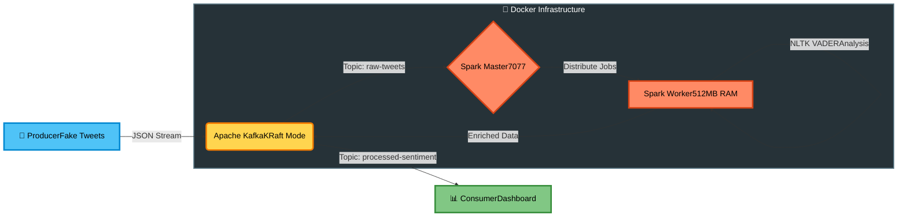

# ⚡ Real-Time Sentiment Analysis Pipeline


-black.svg?style=for-the-badge&logo=apachekafka&logoColor=white)


> **Uma arquitetura de Engenharia de Dados orientada a eventos, focada em eficiência de recursos (FinOps), escalabilidade e processamento distribuído em tempo real.**

---

## 📋 Índice

- [Visão Geral](#-visão-geral)
- [Arquitetura](#-arquitetura)
- [Destaques Técnicos](#-destaques-técnicos)
- [Como Executar](#-como-executar)
- [Estrutura do Projeto](#-estrutura-do-projeto)
- [Decisões de Arquitetura](#-decisões-de-arquitetura-adr)
- [Desenvolvimento & Qualidade](#-desenvolvimento--qualidade)
- [Screenshots](#-screenshots)
- [Licença](#-licença)

---

## 🎯 Visão Geral

Este projeto implementa um **pipeline de streaming de dados end-to-end** para análise de sentimentos em tempo real, utilizando tecnologias enterprise-grade com foco em **economia de recursos** (FinOps) e **escalabilidade horizontal**.

### Características Principais

- 🚀 **Processamento em Tempo Real**: Análise de sentimentos com latência sub-segundo utilizando Spark Structured Streaming
- 💰 **FinOps Otimizado**: Redução de ~40% no consumo de memória através do Kafka KRaft (sem Zookeeper)
- 🔄 **Event-Driven Architecture**: Desacoplamento total entre produtores e consumidores via Apache Kafka
- 📊 **Escalabilidade Horizontal**: Cluster Spark Standalone com gestão rigorosa de recursos
- 🛡️ **Produção-Ready**: Limites de CPU/RAM definidos, checkpointing automático e fault tolerance

---

## 🏗 Arquitetura

O projeto segue o padrão **Lambda Architecture** simplificado, implementando um pipeline completo de streaming:


### Fluxo de Dados

1. **Ingestão**: Producer simula tweets usando Faker e envia para o tópico `raw-tweets`
2. **Processamento**: Spark Streaming consome mensagens, aplica análise de sentimento (NLTK VADER) via Pandas UDF
3. **Enriquecimento**: Adiciona score de sentimento (-1.0 a +1.0) e publica no tópico `processed-sentiment`
4. **Consumo**: Consumer lê dados enriquecidos e exibe em tempo real com formatação visual

---

## ✨ Destaques Técnicos

### 1. **Kafka sem Zookeeper (KRaft Mode)**
- **Impacto**: Redução de ~512MB de RAM e eliminação de um ponto de falha
- **Benefício**: Simplificação da arquitetura e redução de custos operacionais em cloud

### 2. **Spark Standalone Cluster com Gestão de Recursos**
- Limites explícitos via `deploy.resources.limits` (CPU: 1 core, RAM: 1.5GB)
- Arquitetura desacoplada Master/Worker para escalabilidade futura
- Configuração de memória otimizada (`SPARK_DAEMON_MEMORY=512m`)

### 3. **Pandas UDF (Vectorized Processing)**
- Utiliza **Apache Arrow** para transferência zero-copy entre Spark e Pandas
- **Performance**: 3-100x mais rápido que UDFs tradicionais para operações de ML/NLP
- Evita overhead de serialização Python ↔ JVM

### 4. **Resiliência e Compatibilidade Multi-Ambiente**
- Detecção automática de ambiente (Docker vs Local) via `/.dockerenv`
- API Version explícita (`api_version=(2,8,1)`) para estabilidade em Windows/WSL
- Failsafe NLTK: Download automático de léxicos se não encontrados

### 5. **Checkpoint Strategy**
- Localização persistente: `/data/checkpoints/sentiment_job_v1`
- Garante **exactly-once semantics** e recuperação automática de falhas

---

## 🚀 Como Executar

### Pré-requisitos

- **Docker** (v20.10+) & **Docker Compose** (v2.0+)
- **Python** 3.10+ (para scripts locais)
- **Make** (opcional, mas recomendado)
- **4GB RAM** disponível (2GB para Spark + 768MB para Kafka)

---

### 1️⃣ Inicialização do Ambiente

Clone o repositório e suba a infraestrutura completa:
```bash
# Clone o repositório
git clone https://github.com/Alefx33/spark-streaming-sentiment-local.git
cd spark-streaming-sentiment-local

# Suba Kafka + Spark Cluster (build automático)
make up

# OU, se não tiver Make instalado:
docker-compose up -d --build
```

⏳ **Aguarde ~30-45 segundos** para que os serviços inicializem completamente.

---

### 2️⃣ Verificação de Saúde do Cluster

Antes de executar os jobs, confirme que o cluster está operacional:

| Serviço | URL | Descrição |
|---------|-----|-----------|
| **Spark Master UI** | [http://localhost:9090](http://localhost:9090) | Dashboard do cluster (workers, jobs ativos) |
| **Kafka Broker** | `localhost:9094` | Porta externa para produtores/consumidores locais |

✅ **Checkpoint**: Você deve ver **1 Worker ativo** na Spark UI.

---

### 3️⃣ Executando o Pipeline Completo

Abra **3 terminais separados** para visualizar o fluxo end-to-end:

#### 🟢 Terminal A: Producer (Gerador de Dados)
```bash
python -m app.scripts.producer
```

**O que faz**: Simula um stream contínuo de tweets (5-20 palavras, usuários aleatórios) e envia para `raw-tweets`.

**Saída esperada**:
```
✅ Conectado ao Kafka em 127.0.0.1:9094
🚀 Iniciando stream de tweets para: 'raw-tweets'
📤 Tweet enviado de @john_doe
📤 Tweet enviado de @alice_smith
```

---

#### 🟡 Terminal B: Spark Job (Processamento)
```bash
docker exec -it spark-master /opt/spark/bin/spark-submit \
  --master spark://spark-master:7077 \
  --packages org.apache.spark:spark-sql-kafka-0-10_2.12:3.5.0 \
  --executor-memory 512m \
  /app/jobs/sentiment.py
```

**O que faz**: Submete o job de análise de sentimento ao cluster. O Spark consome `raw-tweets`, aplica NLTK VADER e publica no tópico `processed-sentiment`.

**Logs importantes**:
```
INFO SparkContext: Running Spark version 3.5.0
INFO DAGScheduler: Job 0 finished
```

---

#### 🔵 Terminal C: Consumer (Visualização)
```bash
python -m app.scripts.consumer
```

**O que faz**: Lê os dados enriquecidos e exibe com formatação colorida baseada no score de sentimento.

**Saída esperada**:


---

#### 🎬 Demonstração Visual


*Producer gerando tweets sintéticos em tempo real*

---

### 4️⃣ Monitoramento Avançado
```bash
# Acompanhar logs de todos os serviços
make logs

# Verificar status dos containers
docker-compose ps

# Acessar shell do Spark Master
docker exec -it spark-master /bin/bash
```

---

### 5️⃣ Parar o Ambiente
```bash
# Parar todos os serviços
make down

# OU
docker-compose down

# Para limpar volumes persistentes (CUIDADO: apaga dados do Kafka)
docker-compose down -v
```

---

## 📂 Estrutura do Projeto
```plaintext
.
├── app/
│   ├── __init__.py
│   ├── config.py              # Configuração centralizada (env-aware)
│   ├── jobs/
│   │   └── sentiment.py       # Spark Structured Streaming Job
│   ├── schemas/
│   │   └── tweet.py           # Schema StructType para validação
│   └── scripts/
│       ├── producer.py        # Simulador de tweets (Faker)
│       └── consumer.py        # Leitor do tópico processado
│
├── infra/
│   └── Dockerfile             # Imagem otimizada (Python 3.10 + Spark 3.5.0)
│
├── docs/
│   ├── adr/
│   │   └── 001-uso-do-kafka.md # ADR: Kafka KRaft vs Zookeeper
│   └── ENGINEERING_GUIDE.md    # Princípios e padrões do projeto
│
├── tests/
│   ├── unit/                  # Testes unitários (pytest)
│   └── integration/           # Testes de integração
│
├── docker-compose.yml         # Orquestração (Kafka + Spark cluster)
├── Makefile                   # Automação de comandos
├── pyproject.toml             # Gerenciamento de dependências
├── .pre-commit-config.yaml    # Hooks de qualidade (Black, Flake8)
└── README.md                  # Este arquivo
```

### Arquivos-Chave

| Arquivo | Responsabilidade |
|---------|------------------|
| `app/config.py` | Detecção de ambiente (Docker vs Local) e configuração de endpoints |
| `app/jobs/sentiment.py` | Lógica principal do Spark Streaming + Pandas UDF |
| `infra/Dockerfile` | Build otimizado com Java 17, Spark 3.5.0 e NLTK pré-configurado |
| `docker-compose.yml` | Define limites de recursos (`deploy.resources.limits`) |

---

## 🧠 Decisões de Arquitetura (ADR)

Documentamos escolhas técnicas críticas seguindo o padrão **MADR** (Markdown Architectural Decision Records):

### [ADR-001: Adoção do Kafka em Modo KRaft](docs/adr/001-uso-do-kafka.md)

**Contexto**: Necessidade de mensageria para streaming com replayability (vital para MLOps).

**Decisão**: Kafka 3.7.0 em modo KRaft (sem Zookeeper).

**Consequências**:
- ✅ Redução de ~40% no consumo de memória
- ✅ Simplificação da arquitetura (1 serviço a menos)
- ⚠️ Curva de aprendizado maior que RabbitMQ

**Alternativas Rejeitadas**:
- RabbitMQ (retenção de logs limitada)
- Google Pub/Sub (vendor lock-in)

---

## 🛠 Desenvolvimento & Qualidade

### Pre-Commit Hooks

O projeto utiliza **automação de qualidade** para prevenir erros antes do commit:
```bash
# Instalar hooks (executa Black, Flake8, trailing-whitespace)
make setup

# OU manualmente:
pip install pre-commit
pre-commit install
```

**Ferramentas ativas**:
- **Black**: Formatação automática (line-length: 120)
- **Flake8**: Linting (PEP8 compliance)
- **Pre-commit hooks**: Trailing whitespace, end-of-file fixer

---

### Convenções de Código

1. **Imports Absolutos**: Sempre use `from app.config import settings` (nunca relativos)
2. **Type Hints**: Obrigatórios em funções públicas
3. **Docstrings**: Siga o padrão Google para funções complexas
4. **Commits**: Conventional Commits (`feat:`, `fix:`, `infra:`, `docs:`)

Exemplo:
```bash
git commit -m "feat(spark): add pandas udf for sentiment analysis"
git commit -m "infra(docker): reduce kafka memory limit to 768MB"
```

---

### Testes (Roadmap)
```bash
# Executar testes unitários
make test

# OU dentro do container:
docker exec -it spark-master pytest /app/tests
```

**Cobertura atual**: 🚧 Em desenvolvimento

---

## 📸 Screenshots

### Producer Gerando Tweets


### Consumer Exibindo Análise de Sentimentos


---

## 📊 Métricas de Performance

| Métrica | Valor | Observação |
|---------|-------|------------|
| **Latência (E2E)** | < 500ms | Producer → Kafka → Spark → Consumer |
| **Throughput** | ~200 msgs/seg | Configuração local (1 worker) |
| **Memória Total** | ~2.3GB | Kafka (768MB) + Spark (1.5GB) |
| **CPU Utilização** | 30-50% | 2 cores alocados (1 por serviço) |

*Medições realizadas em ambiente local (Windows 11 WSL2, 16GB RAM)*

---

## 🤝 Contribuindo

Contribuições são bem-vindas! Para mudanças significativas:

1. Abra uma **issue** descrevendo a proposta
2. Crie um **fork** do projeto
3. Crie uma **branch** de feature (`git checkout -b feat/amazing-feature`)
4. Commit suas mudanças (`git commit -m 'feat: add amazing feature'`)
5. Push para a branch (`git push origin feat/amazing-feature`)
6. Abra um **Pull Request**

**Importante**: Todos os PRs devem passar pelos hooks do pre-commit.

---

## 📜 Licença

Distribuído sob a licença **MIT**. Veja [LICENSE](LICENSE) para mais informações.

---

## 🙏 Agradecimentos

- [Apache Spark](https://spark.apache.org/) - Engine de processamento distribuído
- [Apache Kafka](https://kafka.apache.org/) - Plataforma de streaming
- [NLTK](https://www.nltk.org/) - Toolkit de processamento de linguagem natural
- [Faker](https://faker.readthedocs.io/) - Geração de dados sintéticos

---

## 📧 Contato

**Alex Oliveira Mendes** - MLE & SRE Engineer

[](https://www.linkedin.com/in/alex-mendes-80244b292/)
[](https://github.com/Alefx33)

---

<div align="center">

**⭐ Se este projeto foi útil, considere dar uma estrela!**

</div>
